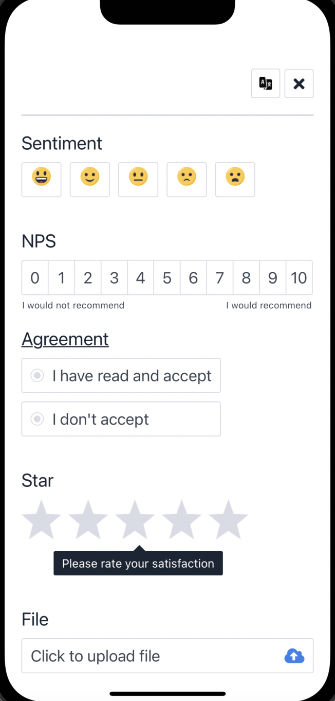
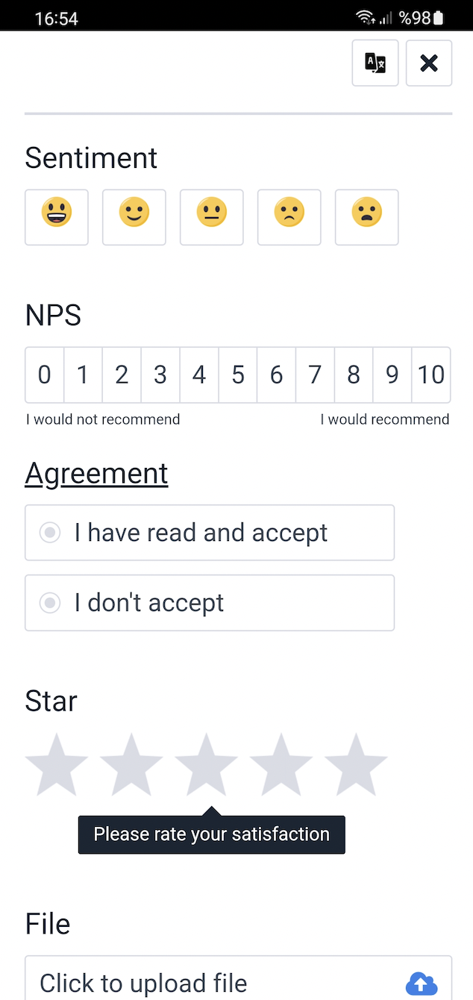

# Pisano Feedback Flutter SDK — Sample App (git dependency)

Standalone Flutter sample app that uses `feedback_flutter_sdk` via a **remote git dependency** (NOT a local path).

> This repository is a **sample app repo**. The **SDK source code is not in this repo**.

This README is intentionally modeled after:
- Flutter SDK README: [Pisano `feedback-flutter-sdk` README](https://github.com/Pisano/feedback-flutter-sdk/blob/main/README.md)
- iOS sample README style: [Pisano `feedback-sample-ios-app` README](https://github.com/Pisano/feedback-sample-ios-app/blob/main/README.md)

## 📋 Table of Contents

- [Features](#-features)
- [Requirements](#-requirements)
- [Installation (remote)](#-installation-remote)
- [Run (Android / iOS)](#-run-android--ios)
- [Local credentials (do not commit)](#-credentials--urls-local-only)
- [Quick Start (API examples)](#-quick-start-api-examples)
- [API Reference](#-api-reference)
  - [`FeedbackFlutterSdk`](#feedbackfluttersdk)
  - [`ViewMode`](#viewmode)
  - [`FeedbackCallback`](#feedbackcallback)
- [Frequently Asked Questions](#-frequently-asked-questions)
- [Troubleshooting](#-troubleshooting)
- [Smoke tests](#-smoke-tests)
- [Screenshots](#-screenshots)

## ✨ Features

- ✅ **Feedback widget (web-based UI)**: rendered via the native SDKs
- ✅ **One Flutter API**: same Dart calls for Android + iOS (`init`, `show`, `track`, `clear`)
- ✅ **View modes**: full screen and bottom sheet
- ✅ **Customer + payload**: pass customer attributes and transactional payload
- ✅ **Multi-language**: provide `language`
- ✅ **Custom title**: provide `title` + `titleFontSize`

## 📱 Requirements

- Flutter installed (`flutter --version`)
- For iOS runs: Xcode + CocoaPods

## 📦 Installation (remote)

This app consumes the SDK via git dependency in `pubspec.yaml`:

```yaml
dependencies:
  feedback_flutter_sdk:
    git:
      url: https://github.com/Pisano/feedback-flutter-sdk.git
      ref: 0.0.17
```

Then:

```bash
flutter pub get
```

## 🔑 Credentials / URLs (local-only)

This repo does **not** commit real credentials. Provide them via `--dart-define-from-file` (recommended).

### Option A) `--dart-define-from-file` (recommended)

1) Copy `pisano_defines.json.example` → `pisano_defines.json` and fill your values.
2) Run:

```bash
flutter run -d <device_id> --dart-define-from-file=pisano_defines.json
```

`pisano_defines.json` is ignored by git via `.gitignore`.

### Note about running from Xcode (iOS)

When you press **Run** in Xcode, `--dart-define-from-file` is not applied automatically.
For local testing with keys, prefer running from the Flutter CLI:

```bash
flutter run -d <device_id> --dart-define-from-file=pisano_defines.json
```

(`pisano_defines.json` stays local and is ignored by git.)

#### Config keys

- `PISANO_APP_ID`
- `PISANO_ACCESS_KEY`
- `PISANO_CODE` (survey/channel code from Pisano panel; required for init)
- `PISANO_API_URL`
- `PISANO_FEEDBACK_URL`
- `PISANO_EVENT_URL` (optional; keep empty to disable)
- `PISANO_LANGUAGE` (e.g. `tr`, `en`)
- `PISANO_DEBUG_LOGGING` (`true` / `false`)

### Option B) `--dart-define`

```bash
flutter run -d <device_id> \
  --dart-define=PISANO_APP_ID=YOUR_APP_ID \
  --dart-define=PISANO_ACCESS_KEY=YOUR_ACCESS_KEY \
  --dart-define=PISANO_CODE=YOUR_CODE \
  --dart-define=PISANO_API_URL=YOUR_API_URL \
  --dart-define=PISANO_FEEDBACK_URL=YOUR_FEEDBACK_URL \
  --dart-define=PISANO_EVENT_URL= \
  --dart-define=PISANO_LANGUAGE=tr \
  --dart-define=PISANO_DEBUG_LOGGING=false
```

## 🚀 Run (Android / iOS)

### Android

```bash
flutter run -d <android_device_id> --dart-define-from-file=pisano_defines.json
```

### iOS (Simulator)

```bash
flutter run -d <ios_simulator_id> --dart-define-from-file=pisano_defines.json
```

### iOS (Device)

If your iPhone does not show up as available, ensure:
- Device is **unlocked**
- Connected via **USB**
- **Developer Mode** enabled on device
- “Trust this computer” accepted

## 🚀 Quick Start (API examples)

These examples show the **exact SDK functions** (`init`, `show`, `track`, `clear`) and the most common parameters.

### 1) Import

```dart
import 'package:feedback_flutter_sdk/feedback_flutter_sdk.dart';
```

### 2) Initialize (Boot)

Call once at app startup (or before the first `show()` / `track()`):

```dart
final feedbackSdk = FeedbackFlutterSdk();

await feedbackSdk.init(
  '<applicationId>',
  '<accessKey>',
  '<apiUrl>',
  '<feedbackUrl>',
  null, // eventUrl (optional)
  debugLogging: false,
  code: '<surveyOrChannelCode>', // required; from Pisano panel
);
```

In this sample, these values come from `--dart-define*` via `lib/pisano_config.dart`.

### 3) Show widget

- **`code` in `show()` is optional.**  
  - If you **pass** `code`, the SDK shows the survey for that code.  
  - If you **omit** it, the SDK uses the **boot code** from `init()` (default survey).
- Example without `code` (uses boot survey):

```dart
final callback = await feedbackSdk.show(
  viewMode: ViewMode.bottomSheetMode,
  title: 'We Value Your Feedback',
  titleFontSize: 20,
  language: 'tr',
  customer: {
    'externalId': 'CRM-12345',
    'phoneNumber': '+905001112233',
  },
  payload: {'source': 'app', 'screen': 'home'},
);
print('show callback: $callback');
```

- To show a **different** survey than the boot one, pass `code: 'OTHER_SURVEY_CODE'` in `show()`.

### 4) Track event

```dart
final callback = await feedbackSdk.track(
  'view_promo',
  language: 'tr',
  customer: {'externalId': 'CRM-12345'},
  payload: {'campaign': 'winter'},
);

print('track callback: $callback');
```

### 5) Clear

```dart
await feedbackSdk.clear();
```

## 📚 API Reference

### `FeedbackFlutterSdk`

- **`Future<void> init(applicationId, accessKey, apiUrl, feedbackUrl, eventUrl, {debugLogging, required code})`**
  - Must be called before `show` / `track`
  - `eventUrl` is optional (use `null` / empty in config to disable)
  - `code` is required (survey/channel code from Pisano panel)
- **`Future<FeedbackCallback> show({viewMode, title, titleFontSize, code, language, customer, payload})`**
  - **`code` (optional):** If you pass it, the SDK shows the survey for that code. If you omit it, the SDK uses the **boot code** from `init()` (default survey).
- **`Future<FeedbackCallback> track(event, {language, customer, payload})`**
- **`Future<void> clear()`**

### `ViewMode`

- **`ViewMode.defaultMode`**: full screen
- **`ViewMode.bottomSheetMode`**: bottom sheet

### `FeedbackCallback`

Returned from `show()` and `track()` and can be used for UI/logging.

Common values:

- `opened`, `closed`, `outside`, `sendFeedback`
- `displayOnce`, `preventMultipleFeedback`, `channelQuotaExceeded`, `none`

> Note: This Flutter sample does not expose a dedicated `healthCheck()` function.  
> To validate reachability, use the **“Remote connected” checklist** below (init + show/track callbacks).

## 🧠 How the SDK is used in this app

### Initialization (Boot)

The app calls `FeedbackFlutterSdk.init(...)` once at startup from `initState()` in `lib/main.dart`.

- If `PisanoConfig` is still using placeholders, the sample intentionally **skips init** and shows an “not set” banner.
- If init succeeds, you should see a log similar to: `Pisano init completed`.

Config is read from `--dart-define` via `lib/pisano_config.dart`.

### Showing the widget

The “Get Feedback” button calls `feedbackSdk.show(...)` with:
- `viewMode`
- optional `title` + `titleFontSize`
- optional **`code`**: if you pass it, the system shows the survey for that code; if you omit it, the system uses the **boot code** from `init()` (default survey).
- optional `language`
- `customer` map
- `payload` map

### Tracking

The “Track” button calls `feedbackSdk.track('view_promo', ...)`.

### Clearing

The “Clear” button calls `feedbackSdk.clear()`.

## ✅ “Remote connected” checklist

After running with real credentials:

- You see `Pisano init completed` in logs
- “SDK not initialized” banner disappears
- Tapping **Get Feedback** opens the widget (or returns a meaningful callback)
- Tapping **Track** returns a non-error callback

If init fails, the error is displayed in-app; re-run the app after changing `--dart-define*` values (hot restart is not enough).

## ⚙️ Platform notes

### Android network permission (important for Release builds)

Your app must declare `android.permission.INTERNET` in the **main** manifest so it’s present in release builds:

- `android/app/src/main/AndroidManifest.xml`

### iOS ATS / HTTPS

Prefer **HTTPS** URLs for `PISANO_API_URL` / `PISANO_FEEDBACK_URL` / `PISANO_EVENT_URL`.
If you must use HTTP, you’ll need an ATS exception in `ios/Runner/Info.plist`.

### iOS permissions (only if your flows use attachments)

If your flows use camera / photo library attachments, add these to `ios/Runner/Info.plist`:

- `NSCameraUsageDescription`
- `NSPhotoLibraryUsageDescription`
- `NSPhotoLibraryAddUsageDescription`

## ❓ Troubleshooting

### “PisanoConfig is not set …”

- Run with `--dart-define-from-file=pisano_defines.json`
- Confirm the file is next to `pubspec.yaml`
- Stop and re-run `flutter run` (hot restart is not enough for new `--dart-define` values)

### “SDK not initialized yet”

- Ensure init succeeded (see checklist above)
- Ensure credentials/URLs are correct and not empty

### iOS CocoaPods

If iOS build fails due to pods (or after upgrading to SDK 0.0.17+):

```bash
cd ios
pod repo update && LANG=en_US.UTF-8 LC_ALL=en_US.UTF-8 pod install
cd ..
```

If your terminal locale is not UTF-8, CocoaPods can fail with encoding errors. The command above forces UTF-8 for the install.

## ❓ Frequently Asked Questions

### When should I call `init`?

Call `await feedbackSdk.init(...)` once at app startup (or before the first `show()` / `track()`).

### Why doesn’t it work when I press Run in Xcode?

Xcode “Run” does not automatically apply `--dart-define-from-file`. For local testing with credentials, prefer running via Flutter CLI (see “Credentials / URLs”).

### Is there a `healthCheck()` API?

Not in this Flutter SDK surface. Use init logs and the “Remote connected” checklist (and `show` / `track` callbacks) as a practical preflight.

## ✅ Smoke tests

From repo root:

```bash
flutter analyze
flutter test

flutter build apk --release
flutter build ios --no-codesign
```

## 📷 Screenshots

iOS              |  Android
:-------------------------:|:-------------------------:
  |  

